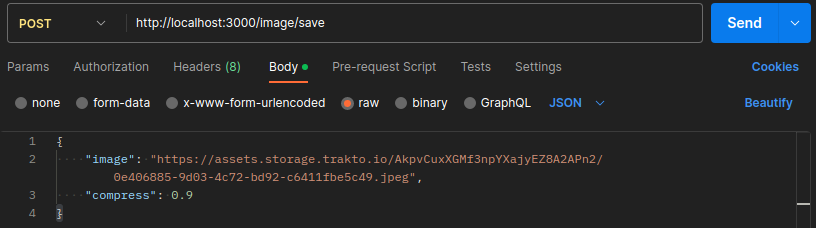
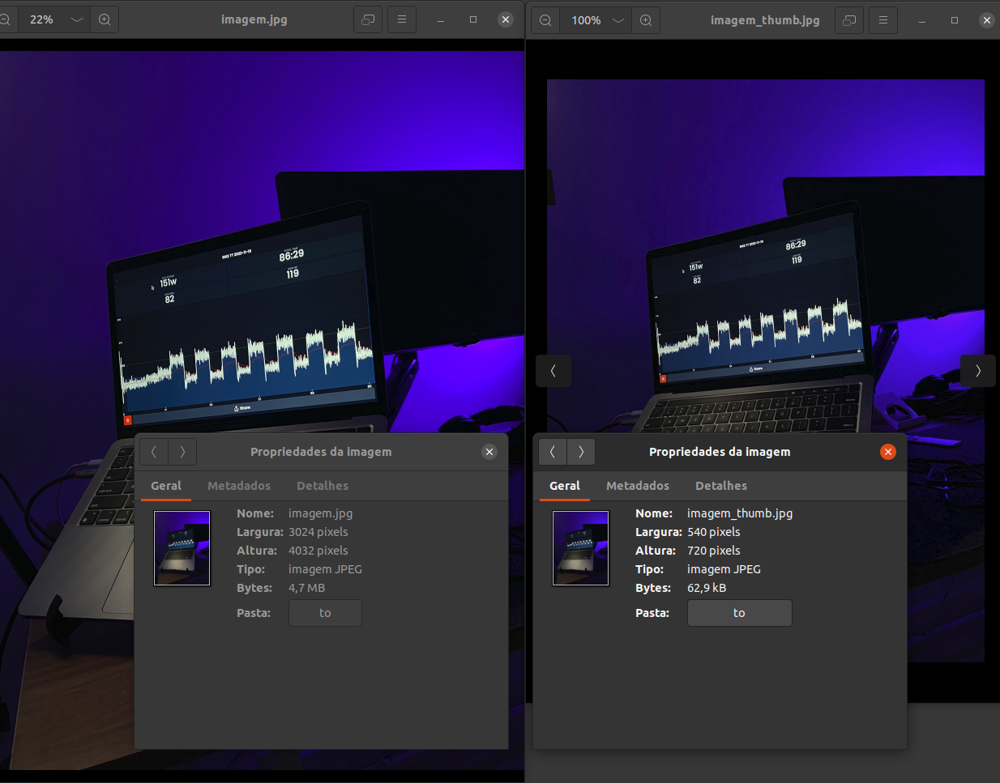

<h1 align="center">
  Backend - compressor de imagens
</h1>

## Descrição
<p align="jistify">
  Projeto realizado com objetivo de realizar a compressão de uma imagem tendo como base uma determinada URL, gerando uma thumb e salvando também os metadados da imagem original em um banco de dados não relacional.
  <br>
</p>

## Tecnologias utilizadas
<ul>
  <li>NestJs</li>
  <li>Typescript</li>
  <li>Express</li>
  <li>Mongoose</li>
  <li>MongoDb</li>
  <li>Jimp</li>
  <li>Uuid</li>
</ul>

## Instalando projeto
<p>Em seu terminal digite o seguinte código:</p>

```bash
$ npm install
```

## Iniciando a aplicação

<p>Em seu terminal digite o seguinte código:</p>

```bash
$ docker-compose up -d

$ npm run start
```

## Após os passos anteriores para utilizar a aplicação siga os seguintes passos
<p>Recomendo a utilização de alguma plataforma para teste de APIs como as seguintes descritas</p>
<ul>
  <li>Insomnia</li>
  <li>Thunderclient</li>
  <li>Postman</li>
</ul>

Digite na url de alguma das plataformas citadas anteriormente a seguinte URL para o método POST

http://localhost:3000/image/save

em conjunto informe no objeto a ser passado a url da imagem a ser comprimida e o fator de compressão que deve variar entre 0 e 1

<div align="left">
  
</div>

## Exemplo
Para este exemplo de requisição

```bash
{
    "image": "https://assets.storage.trakto.io/AkpvCuxXGMf3npYXajyEZ8A2APn2/0e406885-9d03-4c72-bd92-c6411fbe5c49.jpeg",
    "compress": 0.9
}
```

A seguinte resposta foi obtida

```bash
{
    "localpath": {
        "original": "./path/to/imagem.jpg",
        "thumb": "./path/to/imagem_thumb.jpg"
    },
    "metadata": {
        "meta": {
            "startMarker": {
                "offset": 0
            },
            "tags": {
                "Make": "Apple",
                "Model": "iPhone 11",
                "Orientation": 1,
                "XResolution": 72,
                "YResolution": 72,
                "ResolutionUnit": 2,
                "Software": "16.1.1",
                "ModifyDate": 1668716039,
                "HostComputer": "iPhone 11",
                "TileWidth": 512,
                "TileLength": 512,
                "GPSLatitudeRef": "S",
                "GPSLatitude": -9.613122222222222,
                "GPSLongitudeRef": "W",
                "GPSLongitude": -35.7252,
                "GPSAltitudeRef": 0,
                "GPSAltitude": 56.46832101372756,
                "GPSSpeedRef": "K",
                "GPSSpeed": 0.2655744302651217,
                "GPSImgDirectionRef": "T",
                "GPSImgDirection": 162.76583850931678,
                "GPSDestBearingRef": "T",
                "GPSDestBearing": 162.76583850931678,
                "GPSHPositioningError": 7.849353822413682,
                "ExposureTime": 0.023809523809523808,
                "FNumber": 1.8,
                "ExposureProgram": 2,
                "ISO": 320,
                "DateTimeOriginal": 1668716039,
                "CreateDate": 1668716039,
                "undefined": "-03:00",
                "ShutterSpeedValue": 5.381182507010322,
                "ApertureValue": 1.6959938128383605,
                "BrightnessValue": -0.6750610904449875,
                "ExposureCompensation": -1.3275746571237175,
                "MeteringMode": 5,
                "Flash": 16,
                "FocalLength": 4.25,
                "SubjectArea": [
                    1996,
                    1499,
                    2206,
                    1387
                ],
                "SubSecTimeOriginal": "890",
                "SubSecTimeDigitized": "890",
                "ExifImageWidth": 3024,
                "ExifImageHeight": 4032,
                "SensingMethod": 2,
                "ExposureMode": 0,
                "WhiteBalance": 0,
                "FocalLengthIn35mmFormat": 26,
                "LensInfo": [
                    1.5399999618512084,
                    4.25,
                    1.8,
                    2.4
                ],
                "LensMake": "Apple",
                "LensModel": "iPhone 11 back dual wide camera 4.25mm f/1.8"
            },
            "imageSize": {
                "height": 4032,
                "width": 3024
            },
            "app1Offset": 24
        }
    }
}
```

Assim se é possível também ver o resultado das imagens pós compressão

<div align="center">
  
</div>